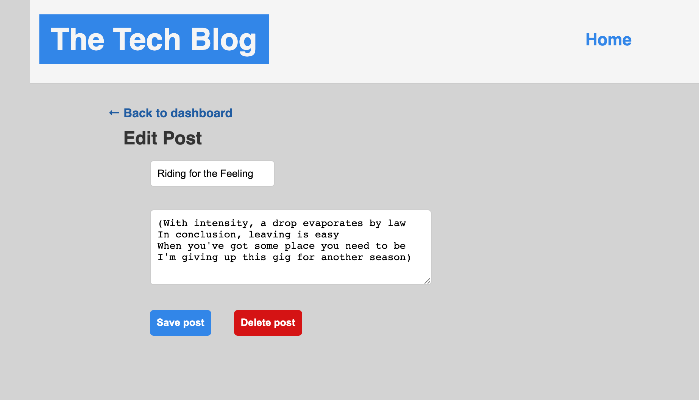

# Tech Blog

## Purpose
User can go to the tech blog site and either create a new username / email / password or login with credentials.  Login requires username and password from validated signup.  Once logged in user can go to dashboard and create new posts.  User can also comment on other posts.  

## Built With
* JavaScript
* Node
* Express
* Mysql
* Sequelize
* Handlebars
* Bcrypt
* Dotenv

## Installation
install node packages mysql2, sequelize express, handlebars, bcrypt, dotenv.

## Contribution
Made by Jon Prine

## Heroku Link
https://serene-falls-33864.herokuapp.com/

## Screenshots of Finished Page

